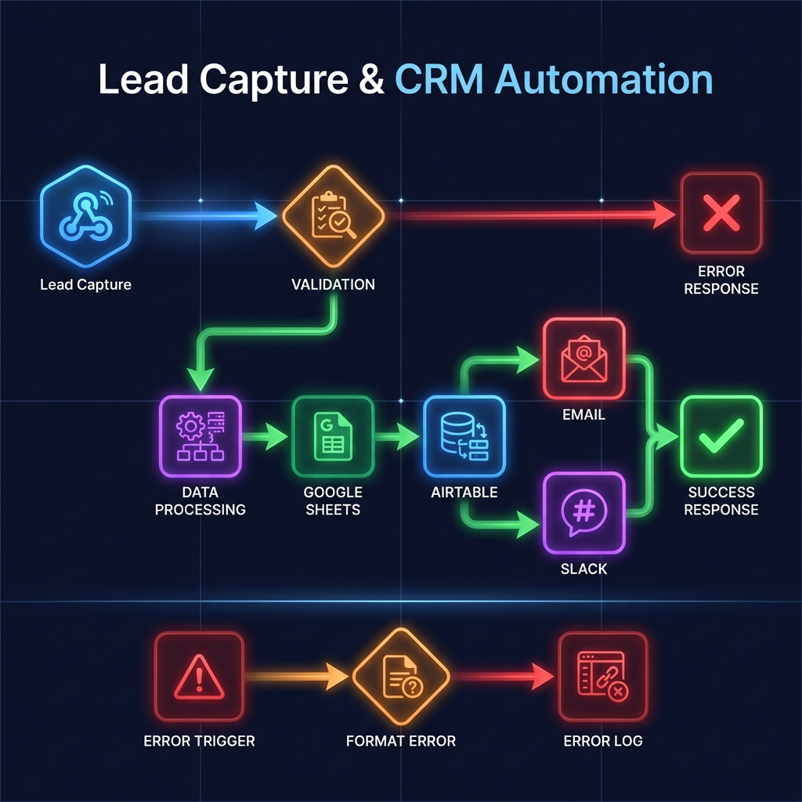

# Lead Capture & CRM Automation

> Automated lead capture system that validates, processes, and syncs leads to Google Sheets + Airtable in real-time.

**Version:** 1.0.0
**Platform:** n8n (v1.0+)
**License:** MIT



---

## Overview

| Step | Action | Result |
|------|--------|--------|
| 1 | Form submitted | Webhook receives data |
| 2 | Validation | Checks required fields & email format |
| 3 | Processing | Cleans data, generates unique Lead ID |
| 4 | Storage | Saves to Google Sheets + Airtable |
| 5 | Response | Returns success/error to form |

---

## Demo

Open `demo/index.html` in your browser to test the workflow with a functional lead capture form.

---

## Requirements

- n8n instance (Cloud or self-hosted, v1.0+)
- Google account with Sheets access
- Airtable account (free tier supported)

---

## Tech Stack

| Tool | Purpose |
|------|---------|
| **n8n** | Workflow automation engine |
| **Webhook** | Real-time lead ingestion |
| **Google Sheets** | Lead database & reporting |
| **Airtable** | CRM-style lead management |

---

## Quick Start

### 1. Import Workflow
```
n8n → Workflows → Import from File → workflow.json
```

### 2. Create Google Sheet
Add these columns to row 1:
```
Lead ID | Name | Email | Source | Phone | Company | Message | Status | Created At
```

### 3. Configure Nodes
- Click **Google Sheets** node → Select your spreadsheet
- Click **Airtable** node → Select your base & table

### 4. Activate & Test
- Toggle workflow **ON**
- Copy webhook URL
- Open `demo/index.html`
- Submit a test lead

---

## API Reference

### Endpoint
```
POST /webhook/lead-capture
```

### Request Body
```json
{
  "name": "John Doe",
  "email": "john@example.com",
  "source": "Website",
  "phone": "+1 555-123-4567",
  "company": "Acme Inc",
  "message": "Interested in your services"
}
```

### Success Response (200)
```json
{
  "status": "success",
  "message": "Lead captured successfully",
  "leadId": "lead_1705329000_a7k2m9",
  "timestamp": "2024-01-15T10:30:00.000Z"
}
```

### Error Response (400)
```json
{
  "status": "error",
  "message": "Validation failed",
  "errors": ["Email is required"]
}
```

---

## Project Structure

```
n8n-lead-automation/
├── workflow.json          # n8n workflow definition
├── LICENSE                # MIT license
├── README.md              # This file
├── .gitignore             # Git ignore rules
├── demo/
│   ├── index.html         # Lead capture form UI
│   ├── style.css          # Responsive styling
│   └── script.js          # Form logic & API client
├── docs/
│   ├── SETUP.md           # Step-by-step setup guide
│   └── TESTING.md         # Test cases & debugging
├── examples/
│   ├── sample-payloads.json   # Test data payloads
│   └── curl-commands.md       # API test commands
└── screenshots/
    └── workflow-overview.png  # Workflow diagram
```

---

## Features

- **Input Validation** - Required field checks, email format validation
- **Data Enrichment** - Auto-generates Lead ID, timestamps, status
- **Multi-Destination Sync** - Google Sheets + Airtable simultaneously
- **Error Handling** - Graceful failures with clear error messages
- **Production Ready** - No hardcoded credentials, secure by design

---

## Use Cases

- Website contact forms
- Landing page lead capture
- Marketing campaign tracking
- Event registration
- Newsletter signups
- Client inquiry forms

---

## Testing

### Quick Test (cURL)
```bash
curl -X POST "YOUR_WEBHOOK_URL" \
  -H "Content-Type: application/json" \
  -d '{"name":"Test User","email":"test@example.com","source":"API Test"}'
```

### Full Test Suite
See `docs/TESTING.md` for comprehensive test scenarios.

---

## Documentation

| Document | Description |
|----------|-------------|
| [SETUP.md](docs/SETUP.md) | Step-by-step setup guide |
| [TESTING.md](docs/TESTING.md) | Test cases & debugging |
| [curl-commands.md](examples/curl-commands.md) | Ready-to-use API tests |

---

## License

MIT License - See [LICENSE](LICENSE) for details.

---

## Extension Ideas

This workflow can be extended with:
- Email notifications (Gmail/Outlook)
- Slack/Discord alerts
- Lead scoring algorithms
- Additional CRM integrations (HubSpot, Salesforce)
- Duplicate detection
- Auto-responder emails

---

## Contributing

1. Fork the repository
2. Create a feature branch
3. Submit a pull request

For bug reports and feature requests, please open an issue.
